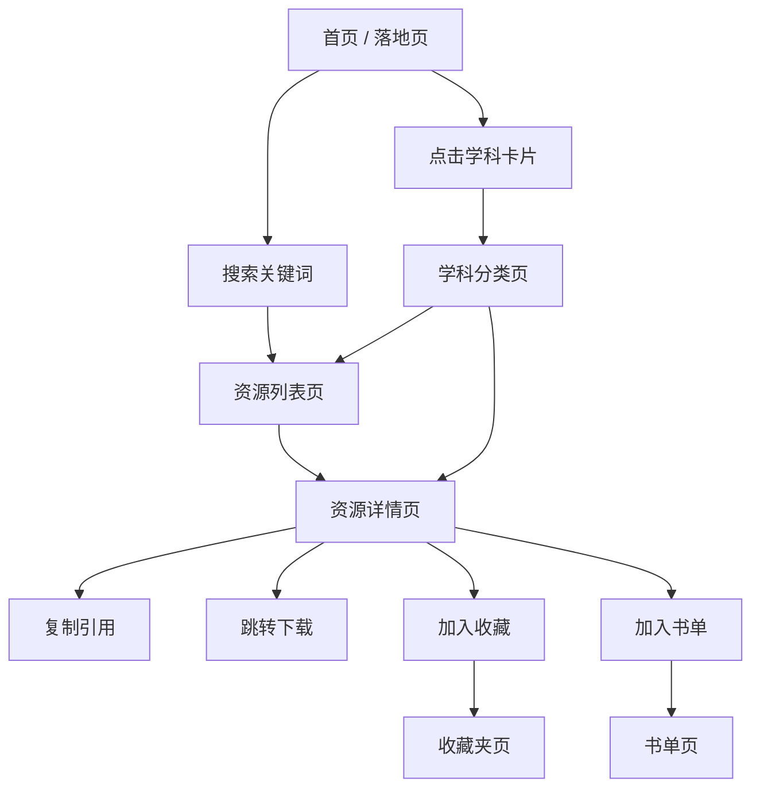

# ScholarHUB 产品需求文档

## 1. 产品概述

ScholarHUB 是面向学生与科研初学者的开放学术资源聚合检索平台。项目将散落在各论文网站、教材仓库与数据集中的可下载资源按学科与主题归类整理，支持一键跳转或下载。

项目采用前后端分离架构：

- **GitHub Pages** 仅托管项目介绍落地页（[`landing/`](../landing/)）。
- **前端应用**（[`frontend/`](../frontend/)）可独立部署，通过 API 与后端交互。
- **后端服务**（[`backend/`](../backend/)）使用 FastAPI + PostgreSQL 真正持久化数据，由 Alembic 管理迁移。

仓库本身也是最终资源索引与部分文件下载源。

## 2. 核心功能

### 2.1 用户体系

- 匿名访客可浏览、搜索、收藏（本地存储）。
- 注册用户可同步收藏、阅读历史与书单到云端。
- 管理员可新增、编辑、删除资源。

### 2.2 功能模块

1. **首页**：项目简介、快捷搜索、学科入口、推荐资源。
2. **资源列表页**：按学科 / 类型 / 年份 / 标签过滤的卡片网格。
3. **资源详情页**：完整摘要、引用格式一键生成（APA / MLA / GB/T 7714 / BibTeX）、跳转下载、相关推荐。
4. **学科分类页**：可折叠的学科卡片，展开后显示该学科下的所有资源。
5. **搜索页**：关键词全文检索，按相关度排序。
6. **收藏夹页**：本地与云端收藏资源，可导出 JSON。
7. **阅读历史页**：最近浏览时间线。
8. **书单页**：自定义资源列表，支持批量导出。
9. **设置页**：深色/浅色模式切换、字体大小、动效开关。
10. **关于页**：项目理念、贡献指南、引用本项目的方式、致谢。
11. **管理后台**：资源 CRUD、用户管理（管理员）。

### 2.3 组合筛选

- 学科 × 资源类型 × 年份 三维筛选。
- 同作者 / 同标签 / 同学科的相关推荐。
- 引用格式一键复制 + 批量导出。
- 本地收藏 + 云端收藏组合。
- 阅读历史 + 最近浏览时间线。
- 书单自定义资源列表。

## 3. 核心流程

## 4. 用户界面设计

### 4.1 设计风格 A + C

- **整体调性**：严谨典雅、简洁唯美，参考《科学美国人》印刷版与 Apple 产品页排版。
- **主色**：墨黑 `#1a1a1a`、纸白 `#f8f6f1`、深灰 `#3c3c3c`。
- **辅色**：墨绿 `#2f4f3a`（强调按钮与链接）、赭石 `#a86b3c`（标签与标记）。
- **字体**：标题 `Cormorant Garamond`，正文 `EB Garamond`，等宽 `JetBrains Mono`，中文回退 `Noto Serif SC`。
- **按钮**：实色矩形 + 极细描边圆角 `2px`，无阴影，hover 时背景从纸白变淡灰或反转。
- **布局**：以"留白 + 卡片折叠"为主，主内容区最大宽 `880px`，左对齐网格。
- **图标**：`lucide-react` 极细线性图标，1.25px 描边。
- **动效**：仅在卡片展开、页面切换、收藏动作处加 0.25s–0.4s 缓动；用户可在设置中减弱或关闭。

### 4.2 设计反 AI 化策略

- **不使用** 彩虹渐变、彩色阴影、毛玻璃、霓虹、emoji 装饰。
- **不使用** 居中大圆角按钮、通用蓝色 (`#3b82f6`) 或紫色 (`#8b5cf6`)。
- **使用** 1px 极细描边、低饱和度、衬线字体、非居中布局、左对齐的"出版感"。

### 4.3 响应式

桌面优先，窗口窄于 768px 时切换为单列布局，字体缩放 0.9。

## 5. 部署形态

| 目标 | 内容 | 路径/地址 |
|---|---|---|
| GitHub Pages | 项目介绍落地页 | `https://<user>.github.io/scholarhub/` |
| 前端应用 | React 完整应用 | 可部署到任意静态托管或 Docker |
| 后端服务 | FastAPI API | Docker / 云服务器 |
| 数据库 | PostgreSQL | Docker / 托管数据库 |

## 6. 开源与社区

- 许可证：MIT
- 贡献指南：[CONTRIBUTING.md](../CONTRIBUTING.md)
- 行为准则：[CODE_OF_CONDUCT.md](../CODE_OF_CONDUCT.md)
- 安全披露：[SECURITY.md](../SECURITY.md)
