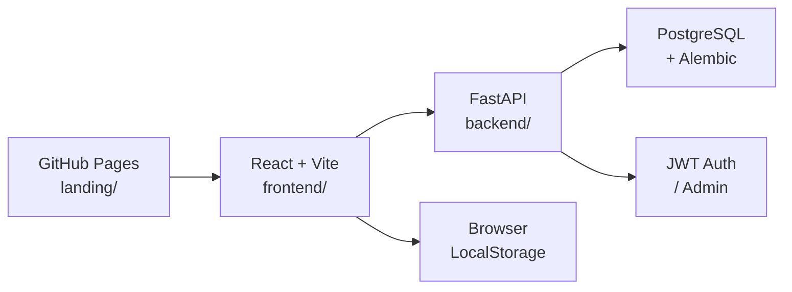
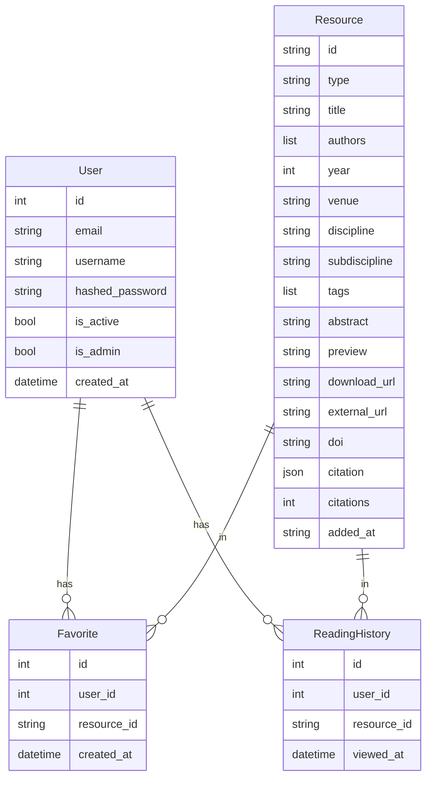

# ScholarHUB 技术架构文档

## 1. 架构概览



ScholarHUB 是前后端分离的 monorepo：

- **`landing/`**：GitHub Pages 项目介绍页，静态 React + Vite。
- **`frontend/`**：完整 React 应用，通过 REST API 与后端交互。
- **`backend/`**：FastAPI 异步后端，连接 PostgreSQL，使用 Alembic 迁移。
- **`infra/`**：Docker、Docker Compose、Nginx 与启动脚本。

## 2. 技术栈

### 2.1 前端

- **框架**：React 19 + TypeScript 5
- **构建工具**：Vite 6
- **样式**：Tailwind CSS 4（自定义 A+C 学术主题）
- **状态管理**：Zustand
- **路由**：React Router 7
- **图标**：lucide-react
- **字体**：Google Fonts（`Cormorant Garamond` / `EB Garamond` / `Noto Serif SC` / `JetBrains Mono`）

### 2.2 后端

- **框架**：FastAPI（Python 3.11+）
- **ORM**：SQLAlchemy 2.x + AsyncSession
- **数据库**：PostgreSQL 16
- **迁移**：Alembic
- **鉴权**：JWT（python-jose）+ bcrypt
- **限流**：slowapi
- **测试**：pytest + pytest-asyncio + httpx

### 2.3 部署

- **容器化**：Docker + Docker Compose
- **Web 服务器**：Nginx（前端静态资源 + API 反向代理）
- **CI/CD**：GitHub Actions
- **落地页托管**：GitHub Pages

## 3. 目录结构

```
scholarhub/
├── backend/              # FastAPI 后端
│   ├── alembic/          # 迁移脚本
│   ├── app/              # 应用代码
│   │   ├── api/          # API 路由
│   │   ├── core/         # 配置、安全、限流、日志
│   │   ├── db/           # 数据库初始化与会话
│   │   ├── middleware/   # 请求日志、安全头
│   │   └── models/       # SQLAlchemy 模型
│   ├── scripts/          # seed、create_admin 等工具脚本
│   └── tests/            # 后端测试
├── frontend/             # React 前端应用
│   ├── public/
│   └── src/
├── landing/              # GitHub Pages 落地页
│   ├── public/
│   └── src/
├── infra/                # Docker、Nginx、Compose
├── .github/workflows/    # CI/CD
├── .trae/documents/      # 设计文档
└── Makefile              # 统一命令入口
```

## 4. 数据模型

### 4.1 核心实体



### 4.2 资源类型

```typescript
type ResourceType = 'paper' | 'book' | 'dataset' | 'tutorial';

interface Resource {
  id: string;
  type: ResourceType;
  title: string;
  authors: string[];
  year: number;
  venue?: string;
  doi?: string;
  discipline: string;
  subdiscipline?: string;
  tags: string[];
  abstract: string;
  preview: string;
  downloadUrl?: string;
  externalUrl?: string;
  citation: {
    apa: string;
    mla: string;
    gbt: string;
    bibtex: string;
  };
  addedAt: string;
}
```

## 5. API 定义

所有 API 以 `/api` 为前缀。

| 方法 | 路径 | 说明 |
|---|---|---|
| GET | `/` | 服务信息 |
| GET | `/health` | 健康检查 |
| GET | `/api/health` | API 健康检查 |
| POST | `/api/auth/register` | 用户注册 |
| POST | `/api/auth/login` | 用户登录 |
| GET | `/api/auth/me` | 当前用户信息 |
| GET | `/api/resources/` | 资源列表（支持筛选、搜索、分页） |
| GET | `/api/resources/stats` | 资源统计 |
| GET | `/api/resources/{id}` | 资源详情 |
| POST | `/api/resources/` | 创建资源（管理员） |
| PUT | `/api/resources/{id}` | 更新资源（管理员） |
| DELETE | `/api/resources/{id}` | 删除资源（管理员） |
| GET | `/api/favorites/` | 当前用户收藏 |
| POST | `/api/favorites/{id}` | 添加收藏 |
| DELETE | `/api/favorites/{id}` | 取消收藏 |
| GET | `/api/history/` | 阅读历史 |
| POST | `/api/history/{id}` | 记录阅读 |

## 6. 路由定义

| 路由 | 用途 |
|---|---|
| `/` | 首页 |
| `/discipline/:slug` | 学科分类页 |
| `/resources` | 资源列表 |
| `/resource/:id` | 资源详情 |
| `/search?q=...` | 搜索结果 |
| `/favorites` | 收藏夹 |
| `/history` | 阅读历史 |
| `/lists` | 书单 |
| `/settings` | 设置 |
| `/about` | 关于 |
| `/login` / `/register` | 登录/注册 |
| `/profile` | 个人中心 |
| `/admin` | 管理后台 |

## 7. 本地开发

```bash
# 一键启动全栈（PostgreSQL + backend + frontend + Nginx）
make up

# 单独启动后端（需本地 PostgreSQL）
make dev-backend

# 单独启动前端
make dev-frontend

# 单独启动落地页
make dev-landing

# 运行迁移
make migrate

# 灌入种子数据
make seed

# 运行测试
make test

# 代码检查
make lint
```

## 8. 部署

### 8.1 GitHub Pages 落地页

由 `.github/workflows/deploy.yml` 驱动，在 `landing/` 变更时自动构建并部署到 GitHub Pages。

### 8.2 前端 + 后端 + 数据库

使用 Docker Compose：

```bash
docker compose -f infra/docker-compose.yml up --build -d
```

生产环境使用 `infra/docker-compose.prod.yml`，并配置 HTTPS、Secrets 与备份。

## 9. 安全

- JWT 存储于 httpOnly cookie（生产环境 secure + sameSite）。
- 密码使用 bcrypt 哈希。
- CORS 限制为已知前端域名。
- 响应头包含 CSP、X-Frame-Options、X-Content-Type-Options 等。
- 依赖安全扫描通过 Dependabot 与 gitleaks 工作流。

## 10. 环境变量

| 变量 | 说明 |
|---|---|
| `SCHOLARHUB_ENVIRONMENT` | `development` / `production` |
| `SCHOLARHUB_DATABASE_URL` | PostgreSQL 连接串 |
| `SCHOLARHUB_SECRET_KEY` | JWT 与加密密钥 |
| `SCHOLARHUB_ADMIN_EMAIL` | 初始管理员邮箱 |
| `SCHOLARHUB_ADMIN_PASSWORD` | 初始管理员密码 |
| `SCHOLARHUB_CORS_ORIGINS` | CORS 来源 JSON 数组 |
| `VITE_API_URL` | 前端调用 API 地址 |
| `VITE_API_MODE` | `remote` / `local` |
| `VITE_BASE_PATH` | 前端 base path |
